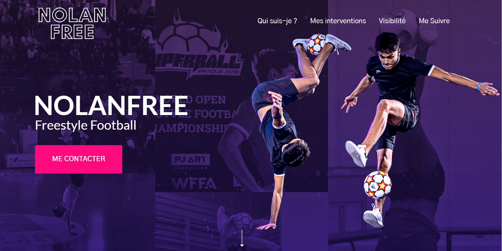

# NolanFree - Freestyle Football

Bienvenue sur le dépôt GitHub de [nolanfree.fr](https://www.nolanfree.fr/), mon site vitrine dédié au freestyle football.

## Qui suis-je ?

Je suis Nolan Cacheux, un expert en freestyle football avec plus de 5 ans d'expérience, issu des championnats du monde de freestyle football.

## Mes interventions

Je propose des animations et des initiations pour tous niveaux, pour vous apprendre des gestes et des combinaisons de freestyle football.

## Visibilité

Au fil des années, j'ai remporté plusieurs titres, notamment celui de champion du monde (catégorie Rookies/Espoirs) à Prague en 2019, et de vice-champion de France lors de la compétition en ligne RedBull StreetStyle en 2022.

En tant que freestyler, j'ai pu faire plusieurs apparitions dans des journaux, vidéos, interviews, articles, etc.

## Me suivre

Retrouvez-moi sur les réseaux sociaux :
- [Instagram](https://www.instagram.com/nolan_cacheux/)
- [Facebook](https://www.facebook.com/nolan.cacheux/)
- [Youtube](https://www.youtube.com/channel/UCFyXCj3kp0Q2L0puWmtU6Lw)
- [LinkedIn](https://www.linkedin.com/in/nolan-cacheux/)

## Me contacter

Pour toute demande, veuillez me contacter par mail à nolan.cacheux@gmail.com ou sur mes réseaux sociaux.

© 2023 Copyright Nolanfree. Tous droits réservés.
